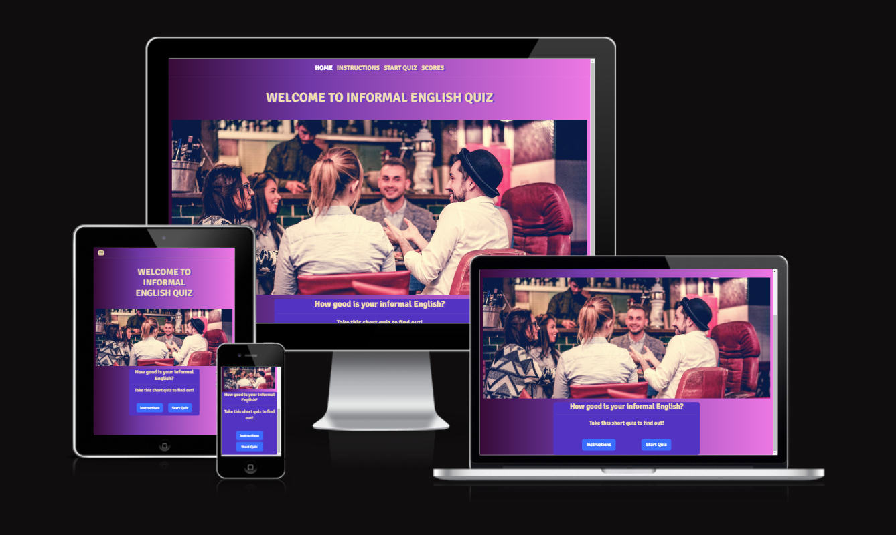

# **INFORMAL ENGLISH QUIZ - 2nd milestone project**

## **Introduction**

 

This is my second milestone project in which I added Java Script to make the website interactive.  I created an Informal English quiz based on a lesson I used to teach as an EFL teacher. The phrases I included in the quiz were very confusing for me when I first arrived in the UK. I did not understand them even though I could speak very good English (at least that's what I thought back then). I hope the use of authentic, real English will make this quiz fun and useful for students of English who want to sound more like native speakers and improve their understanding of informal expressions.

[Visit the website here](https://agyluczak.github.io/INFORMAL-ENGLISH-QUIZ/)

 

## **UX-User Experience Design**
 

 

## **Strategy Plane**

 

**The business goals for the website:**

1. To check students knowledge of some common informal expressions in English.
2. To help students of English learn these expressions by providing an option of retaking the quiz as many times as they want.
3. To promote knowledge of informal English, as it's rarely taught in language schools.
4. To make the quiz fun and enjoyable so that it attracts students to take it more than once.

 

**User stories:**

1. As a first-time visitor, I want to easily understand the purpose of the quiz.
2. As a first-time visitor, I want to easily find instructions for the quiz.
3. As a first-time and returning visitor, I want to be able to easily navigate the quiz. I can access all the pages easily and go back to the Home Page quickly. I also want to be able to quit the quiz if I feel like it.
4. As a first-time and returning visitor, I want to be able to read the text easily and see all images clearly on different devices
5. As a first-time and returning visitor, I want to be able to retake the quiz as many times I want to to learn the expressions I got wrong.
6. As a first-time or returning visitor, I want to be able to save my score.

 

## **Scope Plane**

 

In order to achieve the strategy goals, the following features will be included on the website:
- A welcome message at the top of the Home Page stating clearly it is Informal English Quiz
- A hero image showing people chatting in a pub where people are likely to use Informal English
- A favicon with union-jack which is displayed next to the URL of the site in a browser's address bar to associate the quiz with the English language
- Navbar and buttons to navigate easily between the pages. Exit buttons allowing the user to quit the quiz.
- Instructions page which can be easily accessed through the navbar and the Instructions button
- Clear text and hero image which will be responsive on different devices. Right level of contrast between the text and the background.
- Play again button if the user wants to do the quiz again. The questions and the order of the answers will be shuffled to make the quiz more challenging.
- Submit form at the end of the quiz where a user can save their score after entering their name.

 

## **Structure Plane** 

 

The website consists of four pages:
- **Home**
- **Instructions**
- **Start Quiz**
- **Scores**

The navbar recurring on each page allows users to easily move between the pages and go back to Home Page quickly. I also used buttons to link the pages and make navigation of the website even easier. The exit button is used as well if a user wants to quit the quiz.
I used a Union Jack favicon in the address bar for every page to make it clear to the user they are still on the same website.  I used the same background colours for different sections on each page to create a certain design pattern to the website. The Home Page contains a short welcome message, a hero image and button links to Instructions page and Quiz page. The quiz has  a question container and four answer containers that can be clicked on. At the end of the quiz the users will be taken to the scores page where they can save their score by entering their name. When the submit button is hit the form will be hidden and the score list will appear. Users will have a chance to retake the quiz or quit it by pressing the appropriate button.

 
