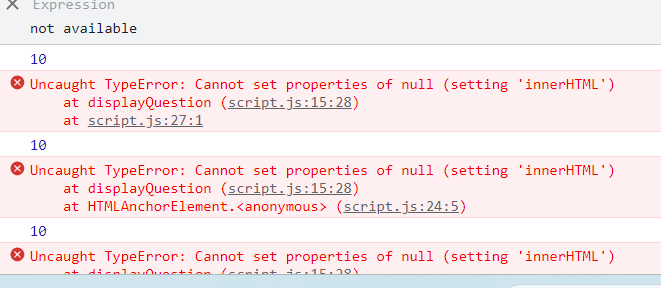

# **INFORMAL ENGLISH QUIZ - 2nd milestone project**

## **Introduction**

 

This is my second milestone project in which I added Java Script to make the website interactive.  I created an Informal English quiz based on a lesson I used to teach as an EFL teacher. The phrases I included in the quiz were very confusing for me when I first arrived in the UK. I did not understand them even though I could speak very good English (at least that's what I thought back then). I hope the use of authentic, real English will make this quiz fun and useful for students of English who want to sound more like native speakers and improve their understanding of informal expressions.

[Visit the website here](https://agyluczak.github.io/INFORMAL-ENGLISH-QUIZ/)

 

## **UX-User Experience Design**
 

 

## **Strategy Plane**

 

**The business goals for the website:**

1. To check students knowledge of some common informal expressions in English.
2. To help students of English learn these expressions by providing an option of retaking the quiz as many times as they want.
3. To promote knowledge of informal English, as it's rarely taught in language schools.
4. To make the quiz fun and enjoyable so that it attracts students to take it more than once.

 

**User stories:**

1. As a first-time visitor, I want to easily understand the purpose of the quiz.
2. As a first-time visitor, I want to easily find instructions for the quiz.
3. As a first-time and returning visitor, I want to be able to easily navigate the quiz. I can access all the pages easily and go back to the Home Page quickly. I also want to be able to quit the quiz if I feel like it.
4. As a first-time and returning visitor, I want to know when the answer I chose is correct/ incorrect.
5. As a first-time and returning visitor, I want to be able to read the text easily and see all images clearly on different devices
6. As a first-time and returning visitor, I want to be able to retake the quiz as many times I want to to learn the expressions I got wrong.
7. As a first-time or returning visitor, I want to be able to save my score.

 

## **Scope Plane**

 

In order to achieve the strategy goals, the following features will be included on the website:
- A welcome message at the top of the Home Page stating clearly it is Informal English Quiz
- A hero image showing people chatting in a pub where people are likely to use Informal English
- A favicon with union-jack which is displayed next to the URL of the site in a browser's address bar to associate the quiz with the English language
- Navbar and buttons to navigate easily between the pages. Exit buttons allowing the user to quit the quiz.
- Instructions page which can be easily accessed through the navbar and the Instructions button
- Clear text and hero image which will be responsive on different devices. Right level of contrast between the text and the background.
- Play again button if the user wants to do the quiz again. The questions and the order of the answers will be shuffled to make the quiz more challenging.
- Submit form at the end of the quiz where a user can save their score after entering their name.

 

## **Structure Plane** 

 

The website consists of four pages:
- **Home**
- **Instructions**
- **Start Quiz**
- **Scores**

The navbar recurring on each page allows users to easily move between the pages and go back to Home Page quickly. I also used buttons to link the pages and make navigation of the website even easier. The exit button is used as well if a user wants to quit the quiz.
I used a Union Jack favicon in the address bar for every page to make it clear to the user they are still on the same website.  I used the same background colours for different sections on each page to create a certain design pattern to the website. The Home Page contains a short welcome message, a hero image and button links to Instructions page and Quiz page. The Quiz Page contains a head-up display with questions and score counter. Below it there is a question container and four answer containers that can be clicked on. At the end of the quiz the users will be taken to the scores page where they can save their score by entering their name. When the submit button is hit the form will be hidden and the score list will appear. Users will have a chance to retake the quiz or quit it by pressing the appropriate button. I also added a 404 error page that directs users to home page in case there is a problem with a link.

 

## **Skeleton Plane**

 

[Wireframes](./docs/Informal_English_wireframes.pdf)

The website looks slightly different from what I initially had in mind when creating the wireframes. 

- I didn't include the list of scores in the wireframes as I wasn't sure if I'll manage to include one.
- I added more bottons for easier navigation
 

## **Surface Plane**

 

I used Google fonts: 'Signika' for all the text in the quiz. It's very clear and easy to read. I used 3 colours for the text: wheat and white and dark purple for the answer containers. I wanted to make sure that there is enough contrast between the text and the backgound colour.The headings and the navbar links have a purple text shadow to add more interesting styling. Whenever the text is more dense (e.g. in Instructions section), I used containers with a different backround colour to create stronger contrast between the text and the background.

I chose two background colours for the backround across the whole webiste: color gradient generated by mixing 2 shades of purple and pink as the body bockround image and a darker colour of blue with a hint of purple as a backround colour for the sections with text and buttons. All buttons have a blue background colour and a white text to make them stand out from the backround. 

In the quiz section I used more vivid colours for the answer containers: coral as the background colour and dark purple for the text. I felt that this section should stand out more.

I wanted all the colours to go together nicely, but also offer enough variety so that the website is eye catching for users.

 

### **Features**

 

- **Navbar** – Reccuring on each page. It's responsive and toggles to a hamburger menu on smaller screens. Menu items are coloured white when the page is active and wheat when inactive. For inactive pages the backround behind menu items changes to darker purple colour when hovered upon and the text colour turns white.

- **Buttons** – Another feature reccuring on each page which helps users with navigation. The buttons can be used to start and quit the quiz, direct users to instructions and score pages and also go back to the Home Page from an error page. After finishing the quiz, users can use the submit button to save their score.

- **Home Page**  Cointains a welcome message: 'Welcome to Informal English' which makes the purpose of the website clear for the users. The page a contains a hero image showing people chatting in a pub to associate the Informal style of English with the environment where it's likely to be used. Below the hero image there is a container with a message inviting users to take the quiz to test their knowledge of Informal English. There are two buttons under the message: one directs users to the Instructions Page and the other one starts the quiz.

- **Instructions Page** includes a container with Instructions and a button to start the quiz.

- **Star Quiz Page** contains the actual quiz. It has a head-up display with questions and score counter. Below the hud there is a question container and 4 answer containers with 4 possible options. If users click on the right option, the background color will turn to green. If they choose the wrong answer, the background colour will change to red. There is a set time-out of 1s after which users are automatically taken to the next question. There is an exit button below the quiz which allows the user to quit the game if they wish to. In that case, they'll be redirected to the Home Page. Both questions and order of the answers are shuffled to make the quiz more challenging. Once all the questions are done a submit form appears so that users can save their score. A submit button under the form takes users to the Scores page.

- **Score Page** shows recent scores. It uses local storage. It also cantains two buttons: Play Again (which takes users to the start of the quiz) and Exit (which takes users back to the Home Page).

- **404 error page** This page helps users go back to the Home Page if anything goes wrong.

- **Favicon** I added a union-jack favicon to relate to the content of the quiz.

### **Features I'd like to incorporate in the future**

 

 - I'd like to use one html page and incorporate more java script to make certain section pop up/ hide

 - I'd like to increase the number of questions and create differnt levels of difficulty

 - I'd like to add back end language to implement a leaderboard that would save the score of users using different devices. Right now I've been only able to use the local storage,

 

 

 

 ## **Technologies Used**

- [HTML](https://developer.mozilla.org/en-US/docs/Web/HTML)
    - Used as the basic building block for the project and to structure the content.

- [CSS](https://developer.mozilla.org/en-US/docs/Learn/Getting_started_with_the_web/CSS_basics)
    - Used to style all the web content across the project. 

- [Bootstrap 5.3](https://getbootstrap.com/)
    - Used as the main framework to make the project responsive.

- [jQuery](https://jquery.com/)
    - Used with Bootstrap to make the navbar responsive.

- [JavaScript](https://www.javascript.com/)
    - Used for the bootstrap navbar for extending collapse plugin to implement responsive behaviour.

- [Google Fonts](https://fonts.google.com/)
    - Used to obtain the fonts used in the project.

- [Google Developer Tools](https://developers.google.com/web/tools/chrome-devtools)
    - Used as a primary method of fixing spacing issues, finding bugs, console errors and testing responsiveness across the project.

- [Github](https://github.com/)
    - Used to store code for the project after being pushed.

- [Git](https://git-scm.com/)
    - Used for version control by utilizing the Gitpod terminal to commit to Git and Push to GitHub.

- [Gitpod](https://www.gitpod.io/)
    - Used as the development enviroment.

- [Balsamiq](https://balsamiq.com/)
    - Used to create the wireframes for the project.

- [Befunky Photo Editor](https://befunky.com)
     - Used to resize and crop the images

- [Style generator](https://html-css-js.com/)
    - Used for colour gradient, text-shadow and box shadow

- [AmIResponsive](http://ami.responsivedesign.is/)
    - Used to generate responsive image of the website used in README file.

- [Readme.so](https://readme.so)
    - Used to edit the readme file.

- [Tables generator](https://www.tablesgenerator.com/)
    - Used to create a table in readme file.

- [W3C Markup Validation Service](https://validator.w3.org/) 
    - Used to validate all HTML code written and used in this webpage.

- [JS Validation Service](https://https://jshint.com/)
    - Used to validate all CSS code written and used in this webpage.

-[ChatGPT4](https://chat.openai.com/)
 - Used to analyse the code from various youtube tutorials for better understanding of the code. Also used along StackOverlow to ask for possible causes of issues I came across while doing the project.

## **Known bugs and fixes**

 

1.  **CSS style could not be applied  to the quiz page**
- ***Solution:*** rearranged the order of the links and put the style sheet link under the bootstrap link. This way it prevented bootstrap from overriding the css style. (Credit: Stackoverflow)

2.	**Answer options didn't display**

- ***Solution:*** added id to each answer option in quiz.html.

3. **The background colour didn't cover the entire element of answer containers**
- ***Solution:*** Added parent.node to selected answer in script.js (credit to my friend Harshit)

4. **Clicking worked only on the text, not on the whole answer container**
- ***Solution:*** moved onclick event to the answer containers in quiz.html

5. **When starting the quiz I was taken to the last question** 
- ***Solution:*** Added a global variable q for the number of  questions (solution found on ChatGPT4)

6.	**Several answer options could be clicked on before moving to the next question**
- ***Solution:*** Added setTimeout function 

7. **The quiz container didn't hide after the last question**
- ***Solution:*** Added a new div with an id outside bootstrap class div to prevent bootstrap from overriding it. (credit to my friend Harshit)

8. **Upon pressing enter instead of submit button, I was taken to the 1st question of the quiz**
- ***Solution:*** Swapped the anchor tag for a button one

9. **Unexpected token error**

- ***Solution:*** Removed the links to script.js from html pages where the logic was not applied

A lot of issues were caused by incorrect syntax, missing brackets or forgetting to call the function

 

