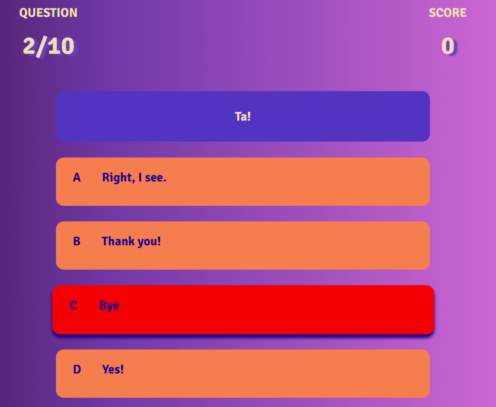
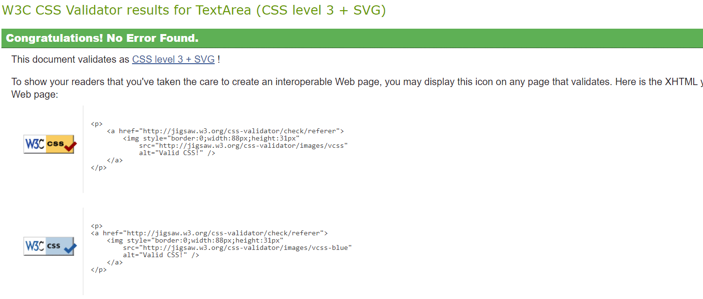
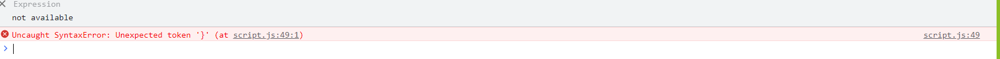

# **INFORMAL ENGLISH QUIZ - 2nd milestone project**

## **Introduction**

 

This is my second milestone project in which I added Java Script to make the website interactive.  I created an Informal English quiz based on a lesson I used to teach as an EFL teacher. The phrases I included in the quiz were very confusing for me when I first arrived in the UK. I did not understand them even though I could speak very good English (at least that's what I thought back then). I hope the use of authentic, real English will make this quiz fun and useful for students of English who want to sound more like native speakers and improve their understanding of informal expressions.

[Visit the website here](https://agyluczak.github.io/INFORMAL-ENGLISH-QUIZ/)

 

## **UX-User Experience Design**

 

## **Strategy Plane**

 

**The business goals for the website:**

1. To check students knowledge of some common informal expressions in English.
2. To help students of English learn these expressions by providing an option of retaking the quiz as many times as they want.
3. To promote knowledge of informal English, as it's rarely taught in language schools.
4. To make the quiz fun and enjoyable so that users are willing to take it more than once.

 

**User stories:**

1. As a first-time visitor, I want to easily understand the purpose of the quiz.
2. As a first-time visitor, I want to easily find instructions for the quiz.
3. As a first-time and returning visitor, I want to be able to easily navigate the quiz. I can access all the pages easily and go back to the Home Page quickly. I also want to be able to quit the quiz if I feel like it.
4. As a first-time and returning visitor, I want to know when the answer I chose is correct/ incorrect.
5. As a first-time and returning visitor, I want to be able to read the text easily and see all images clearly on different devices
6. As a first-time and returning visitor, I want to be able to retake the quiz as many times as I want and learn the expressions I got wrong.
7. As a first-time or returning visitor, I want to be able to save my score.

 

## **Scope Plane**

 

In order to achieve the strategy goals, the following features are included on the website:

- A welcome message at the top of the Home Page stating clearly it is an Informal English Quiz
- A hero image showing people chatting in a pub where people are likely to use Informal English
- A favicon with Union Jack which is displayed next to the URL of the site in a browser's address bar to indicate that the quiz is about the English language
- Navbar and buttons to navigate easily between the pages. Exit buttons allow  users to quit the quiz.
- Instructions page which can be easily accessed through the navbar and the Instructions button
- Clear text and hero image which will be responsive on different devices. Right level of contrast between the text and the background.
- Play again button if users want to do the quiz again. The questions and the order of the answers are shuffled to make the quiz more challenging.
- Submit form at the end of the quiz where users can save their score after entering their name.

 

## **Structure Plane** 

 

The website consists of four pages:
- **Home**
- **Instructions**
- **Start Quiz**
- **Scores**

The navbar recurring on each page allows users to easily move between the pages and go back to Home Page quickly. I also used buttons to link the pages and make navigation of the website even easier. The exit button is used as well if a user wants to quit the quiz.
I used a Union Jack favicon in the address bar for every page to make it clear to users that they are still on the same website.  I used the same background colours for different sections on each page to create a certain design pattern for the website. The Home Page contains a short welcome message, a hero image and button links to Instructions page and Quiz page. The Quiz Page contains a head-up display with questions and score counter. Below it there is a question container and four answer containers that can be clicked on. At the end of the quiz users will be taken to the scores page where they can save their score by entering their name. When the submit button is hit, the form will be hidden and the leaderboard will appear. Users will have a chance to retake the quiz or quit it by pressing the appropriate button. I also added a **404 Error Page** that directs users to the Home Page in case there is a problem with a link.

 

## **Skeleton Plane**

 

[Wireframes](./docs/Informal_English_wireframes.pdf)

The website looks slightly different from what I initially had in mind when creating the wireframes. 

- I didn't include the leaderboard in the wireframes as I wasn't sure if I'll manage to include one.
- I added more buttons for easier navigation

 

## **Surface Plane**

 

I used Google fonts: 'Signika' for all the text in the quiz. It's very clear and easy to read. I used 3 colours for the text: wheat and white and dark purple for the answer containers. I wanted to make sure that there is enough contrast between the text and the background colour. The headings and the navbar links have a purple text shadow to add more interesting styling. Whenever the text is more dense (e.g. in the Instructions section), I used containers with a different backround colour to create stronger contrast between the text and the background.

I chose two background colours for the backround across the whole webiste: colour gradient generated by mixing 2 shades of purple and pink as the body background image and a darker colour of blue with a hint of purple as a backround colour for the sections with text and buttons. All buttons have a blue background colour and a white text to make them stand out on the page. 

In the quiz section I used more vivid colours for the answer containers: coral as the background colour and dark purple for the text. I felt that this section should stand out more.

I wanted all the colours to go together nicely, but also offer enough variety so that the website is eye-catching for users.

 

### **Features**

 

- **Navbar** – Recurring on each page. It's responsive and toggles to a hamburger menu on smaller screens. Menu items are coloured white when the page is active and wheat when inactive. For inactive pages, the background behind menu items changes to darker purple colour when hovered upon and the text colour turns white.

- **Buttons** – Another feature recurring on each page which helps users with navigation. The buttons can be used to start and quit the quiz, direct users to Instructions and Score Pages, and also go back to the Home Page from an Error Page. After finishing the quiz, users can use the submit button to save their score. When hovered upon, the colour of the buttons becomes darker and a box shadow appears.

- **Home Page** - Cointains a welcome message: 'Welcome to Informal English' which makes the purpose of the website clear for users. The page contains a hero image showing people chatting in a pub to link the Informal style of English with the environment where it's likely to be used. Below the hero image there is a container with a message inviting users to take the quiz to test their knowledge of Informal English. There are two buttons under the message: one directs users to the Instructions Page and the other one starts the quiz.

- **Instructions Page** includes a container with Instructions and a button to start the quiz.

- **Star Quiz Page** contains the actual quiz. It has a head-up display with questions and score counter. Below the hud there is a question container and 4 answer containers with 4 possible options. If users click on the right option, the background colour will turn to green. If they choose the wrong answer, the background colour will change to red. There is a set time-out of 1s after which users are automatically taken to the next question. There is an exit button below the quiz which allows users to quit the game if they wish to. In that case, they'll be redirected to the Home Page. Both questions and the order of the answers are shuffled to make the quiz more challenging. Once all the questions are done, a submit form appears so that users can save their score. A submit button under the form takes users to the Scores Page.

- **Score Page** shows recent scores. It uses local storage. It also contains two buttons: Play Again (which takes users to the start of the quiz) and Exit (which takes users back to the Home Page).

- **404 Error Page** This page helps users go back to the Home Page if anything goes wrong.

- **Favicon** I added a Union Jack favicon to relate to the content of the quiz.

### **Features I'd like to incorporate in the future**

 

 - I'd like to use one HTML page and incorporate more Java Script to make certain sections pop up/ hide

 - I'd like to increase the number of questions and create different levels of difficulty

 - I'd like to add back-end language to implement a leaderboard that would save the score of users using different devices. Right now I've been only able to use the local storage.

  

 ## **Technologies Used**

- [HTML](https://developer.mozilla.org/en-US/docs/Web/HTML) - Used as the basic building block for the project and to structure the content.

- [CSS](https://developer.mozilla.org/en-US/docs/Learn/Getting_started_with_the_web/CSS_basics) - Used to style all the web content across the project. 

- [JavaScript](https://www.javascript.com/) - Used for user interaction on the site

- [Bootstrap 5.3](https://getbootstrap.com/) - Used as the main framework to make the project responsive.

- [jQuery](https://jquery.com/) - Used with Bootstrap to make the navbar responsive.

- [Google Fonts](https://fonts.google.com/) - Used to obtain the fonts used in the project.

- [Google Developer Tools](https://developers.google.com/web/tools/chrome-devtools) - Used as a primary method of fixing spacing issues, finding bugs, console errors, and testing responsiveness across the project.

- [Github](https://github.com/) - Used to store code for the project after being pushed.

- [Git](https://git-scm.com/) - Used for version control by utilizing the Gitpod terminal to commit to Git and Push to GitHub.

- [Gitpod](https://www.gitpod.io/) - Used as the development environment.

- [Balsamiq](https://balsamiq.com/) - Used to create the wireframes for the project.

- [Befunky Photo Editor](https://befunky.com) - Used to resize and crop the images

- [Style generator](https://html-css-js.com/) - Used for colour gradient, text-shadow and box-shadow

- [Favicon generator](https://www.favicon-generator.org/) - Used to generate a Union Jack favicon

- [AmIResponsive](http://ami.responsivedesign.is/) - Used to generate a responsive image of the website used in the README file.

- [Readme.so](https://readme.so) - Used to edit the readme file.

- [Tables generator](https://www.tablesgenerator.com/) - Used to create a table in readme file.

- [W3C Markup Validation Service](https://validator.w3.org/) - Used to validate all HTML code written and used in this webpage.

- [W3C CSS Validator](https://jigsaw.w3.org/css-validator/) - Used to validate all CSS code written and used in this webpage.

- [JSHint](https://https://jshint.com/) - Used to validate all JS code written and used in this webpage.

- [ChatGPT4](https://chat.openai.com/) - Used to analyze the code from various youtube tutorials for a better understanding of the code. Also used along StackOverflow to ask for possible causes of issues I came across while doing the project.

 

## **Testing**

I only used Manual Testing for my project, however as a part of the project I need to show awareness of both manual and automated testing and the difference between them.

### **Manual Testing**

Manual testing is done by humans. The development team carry out all actions e.g. identifying potential errors, generating input data, analysing gathered data and evaluating the output. Manual testers need to ensure that the software is functioning correctly on release. Manual testing relies on logic and critical thinking skills. The more experienced  the testers are, the better they are at spotting and predicting bugs. The disadvantage of manual testing is that it takes more time.

**Manual Testing is used for:**

**Usability Testing** - It is user-centric so the best type of test is manual testing. It requires an actual human end user to see if the application is user friendly.

**Ad Hoc Testing** - It is the process of conducting a test on-site, either in progress or after a software release. Ad hoc testing builds on traditional usability tests such as exploratory testing.

**Exploratory Testing** - This type of testing looks for unprecedented scenarios. Human testers are better suited for that role as they can use their experience and expertise to mock different scenarios. A machine is limited to that which is known. 

### **Automated Testing**

Testing is done using different automation tools e.g Jest. An automated test is a set of instructions run by a software program, either to verify the behaviour of the software or to identify bugs in it. A computerized test execute all its steps with minimal human intervention once written.
Automated tests are preferred because they are relatively fast and can be run as often as needed without human involvement. 
To perform an automated test efficiently, you need three pieces: an isolated test environment, a test scripting language (such as Python), and an open-source automation framework.

**Automated Testing is used for:**

**Regression Testing** - It is a repetitive test e.g developing a script to test mundane tasks and standard functions. A regression test is a software testing process that checks an application to see if the changes in new versions have destroyed or damaged old functionalities. This type of test can be time-consuming.

**Performance Testing** - Its aim is to measure response time of a system or an application. Most testers prefer automated tests, as they offer accurate results with minimal human intervention.

**Load Testing** - This type of testing simulates a heavy load on the website. This way developers can identify weaknesses in the system.
With this type of test, the idea is to simulate a heavy load on the website, which helps developers identify weaknesses in the system and make adjustments. Only automated tests can provide such simulations effectively.

 

## **Manual Testing for my project**

 ### User Stories
 
  

1. **As a first-time visitor, I want to easily understand the purpose of the quiz.**

- When users enter the website they see the message 'Welcome to Informal English Quiz'. The hero image below the message show people chatting in a pub where Informal English is likely to be used. Users are then invited to test their Informal English knowledge by taking the quiz. I also used a Union Jack Favicon so that users associate the website with the English language.

 

2. **As a first-time visitor, I want to easily find instructions for the quiz.**

- Users can easily find the instructions either by using a navbar or a button directing them to the Instructions Page.

 

**3. As a first-time and returning visitor, I want to be able to easily navigate the quiz. I can access all the pages easily and go back to the Home Page quickly. I also want to be able to quit the quiz if I feel like it.**

- Users can use both the navbar and the buttons to navigate the website. The exit button is provided below the quiz if users decide to quit the quiz.

 

**4. As a first-time and returning visitor, I want to know when the answer I chose is correct/ incorrect.**

- When users click the right answer, the background colour will change to green and a point will be added to the score counter. If the answer is incorrect, the background colour will change to red and there will be no point added to the score counter.

 

**5. As a first-time and returning visitor, I want to be able to read the text easily and see all images clearly on different devices.**

- I used 'Signika' font which is very clear and simple.  I made sure that the text colour and the background colour have enough contrast to make the content easy to read. Bootsrap 5.3 was used to ensure that the quiz and the hero image are reponsive on different devices and the hero image. I used a media query for the buttons so that they are stacked above each other and don't take much space on smaller devices. 

 

**6. As a first-time and returning visitor, I want to be able to retake the quiz as many times as I want to learn the expressions I got wrong.**

- Users can retake the quiz as many times as they want. Each time a user does the quiz, the questions and the order of the answers will be shuffled to make the quiz more challenging.

 

**7. As a first-time or returning visitor, I want to be able to save my score.**

- At the end of the quiz users can save their score by entering their name in form. Upon clicking submit button or pressing enter they will be taken to the scores page where their score will be saved on the leaderboard. 

 

### Further Testing

 

**The website was tested on the following browsers:**

| BROWSER  | RESULT  |
|---|---|
|  Google Chrome | Success |
| Microsoft Edge  | Success |
| Opera  | Success |
|  Mozilla Firefox | Success |

 

**I used Chrome Developer tools to simulate the following devices:**
- iphone SE
- iphone XR
- iphone 12 Pro
- Pixel 5
- Samsung Galaxy S8+
- Samsung Galaxy S20 Ultra
- iPad Air 
- iPad Mini
- Surface Pro7
- Galaxy Fold 
- Samsung Galaxy A51/71
- Nest Hub 
- Nest Hub Max

The website worked as expected and was responsive on all these devices.

 

### **W3C Markup Validator and W3C CSS Validator.**

 

- [W3C Markup Validator](https://validator.w3.org/)

I used W3C Validator to test all HTML pages in the project and the result of 'no errors' was shown for all of them.

 

- [W3C CSS Validator](https://jigsaw.w3.org/css-validator/)

I used W3C CSS Validator for the CSS and it showed 'no errors'.

### **JSHint**

- [JSHint](https://jshint.com/)

I used JSHint - a code analysis tool for Java Script.
JSHint kept showing me unused variables. A lot of these variables are used in the HTML pages. I went through the JS code to remove all the unused variables.

 

### **Lighthouse**

**I used Lighthouse for testing the website's performance.**

Here are the results:

**Home Page**

**Instructions Page**

**Quiz Page**

**Scores Page**

**Error Page**

 

## **Known bugs and fixes**

 

1.  **CSS style could not be applied  to the quiz page**
- ***Solution:*** rearranged the order of the links and put the style sheet link under the bootstrap link. This way it prevented bootstrap from overriding the css style. (Credit: Stackoverflow)

2.	**Answer options didn't display**

- ***Solution:*** added id to each answer option in quiz.html.

3. **The background colour didn't cover the entire element of answer containers**
- ***Solution:*** Added parent.node to selected answer in script.js (credit to my friend Harshit)

4. **Clicking worked only on the text, not on the whole answer container**
- ***Solution:*** moved onclick event to the answer containers in quiz.html

5. **When starting the quiz I was taken to the last question** 
- ***Solution:*** Added a global variable q for the number of  questions (solution found on ChatGPT4)

6.	**Several answer options could be clicked on before moving to the next question**
- ***Solution:*** Added setTimeout function 

7. **The quiz container didn't hide after the last question**
- ***Solution:*** Added a new div with an id outside bootstrap class div to prevent bootstrap from overriding it. (credit to my friend Harshit)

8. **Upon pressing enter instead of submit button, I was taken to the 1st question of the quiz**
- ***Solution:*** Swapped the anchor tag for a button one

9. **Unexpected token error**

- ***Solution:*** Removed the links to script.js from HTML pages where the logic was not applied

A lot of issues were caused by incorrect syntax, missing brackets or forgetting to call the function

 

## **Deployment**

I deployed this website by using GitPages and followed these steps:

 

**Deploying a GitHub Repository via GitHub Pages** 

 

1. Log in to GitHub
2. In your Repository section, select the repository you want to deploy
3. In the menu located at the top of this section, click *settings*
4. Select *Pages* on the left-hand menu.
5. In the *Source* section select *deploy from a branch*
6. In the *Branch* section select *main* and click *Save*
7. Scroll down to the *Git Hub Pages* section and you will see the message 'Your site is ready to be published' followed by a link to the GitHub Page Web address.

 

**Forking the GitHub Repository**

If you want to make changes to your repository without affecting it, you can make a copy of it by 'Forking' it.

 

1. Find the GitHub repository
2. In the top right corner of the page, click the *Fork* button 
3. You will now have a copy to work on

 

**Cloning the GitHub Repository**  

If you want to download a local version of the repository, you can clone it.

1. Find the GitHub repository
2. Press the arrow on the *Code* button
3. Copy the link that is shown in the drop-down
4. Open Gitpod & select the directory location where you would like the clone created
5. In the terminal type *git clone* and  paste the link you copied in GitHub
6. Press enter and your local clone will be created.

 

## **Credits** ##

 

**Code**

- [W3Schools](https://www.w3schools.com/) - general source of reference

- [Mozilla Javascript Reference](https://developer.mozilla.org/) - general source of reference

- [Stackoverflow](https://stackoverflow.com/) - suggestions for solutions for various problems while doing the project

- [Code with Ania Kubow](https://www.youtube.com/@AniaKubow) - a lot of great videos explaining different concepts of JS

- [Brian Design](https://www.youtube.com/@briandesign) and [James Quick](https://www.youtube.com/@JamesQQuick) - I watched their tutorials on creating a quiz in JavaScript to get a better understanding of all necessary steps in building it. I used some of their ideas in my HTML and CSS.

- [Waldo blogs](https://www.waldo.com/) - a source of information for manual and automated testing

 - My friend Harshit - help with the end of the quiz and creating a leaderboard as well as with shuffling the questions and answers in the quiz

- Rory Patrick Sheridan (my mentor) - various suggestions on improving the project

 
 
**Content**

[ShutterStock](https://shutterstock.com/) - Source of the hero image

I created the content of the quiz.

 

 ## Acknowledgements

  

I would like to say a massive thank you to:
 
 - my course mentor Rory Patrick Sheridan and my tutor Nigel Edwards for their help and support during the project

 - my friend Harshit for his guidance and support during the project
 
 - my classmates Adam and Jacob for their valuable feedback 

 - my husband Gniewomir for his incredible support since the beginning of the course.

